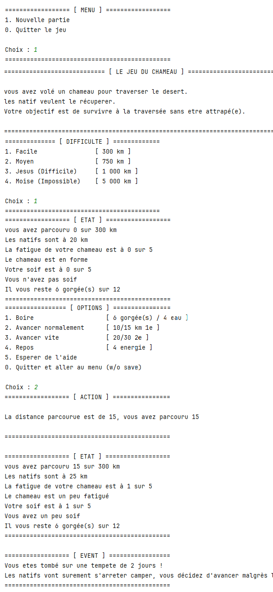

# 🐪 Jeu du Chameau

Ce projet est une implémentation en Java du célèbre "Jeu du Chameau", développé dans le cadre de mon premier semestre de BUT Informatique. Ce jeu repose sur des mécaniques simples, mais est un premier pas vers une application concrète pour utilisateurs.

## 🔍 Présentation du jeu

Le "Jeu du Chameau" est un jeu textuel où le joueur doit traverser le désert tout en gérant ses ressources. Le but est de parcourir la plus grande distance possible sans manquer d’eau ou de se faire rattraper par les bandits du désert.

## 🚀 Fonctionnalités principales
- **Gestion des ressources** : surveillez vos réserves d’eau et d’énergie.
- **Evénements aléatoires** : chaque déplacement peut déclencher un événement aléatoire qui impactera votre progression.
- **Système de distance** : suivez votre progression tout au long du désert tout en essayant d’échapper aux bandits.

### 🔍 Illustration du jeu

